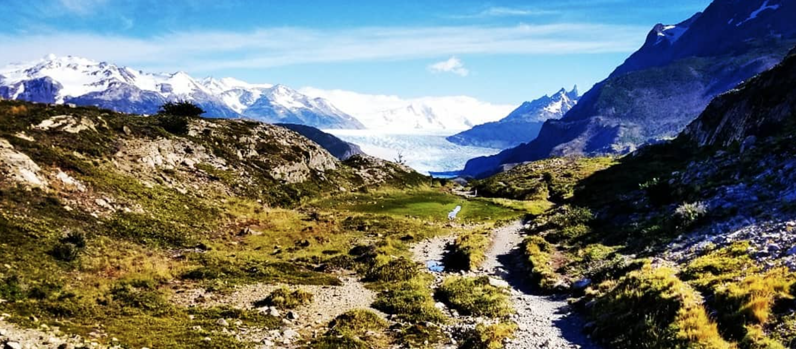
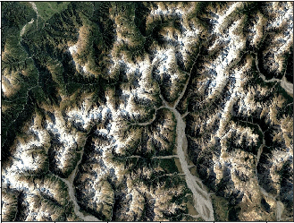
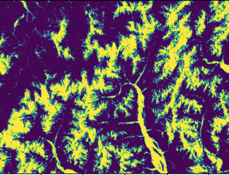
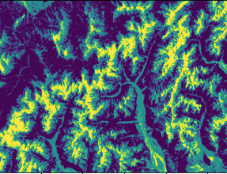
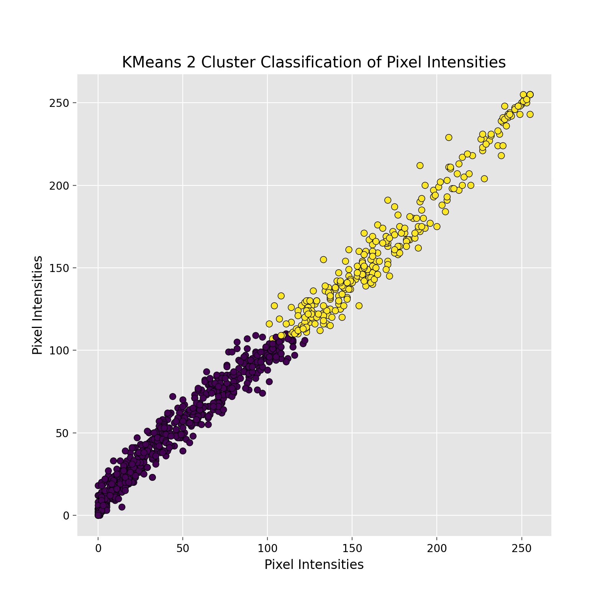
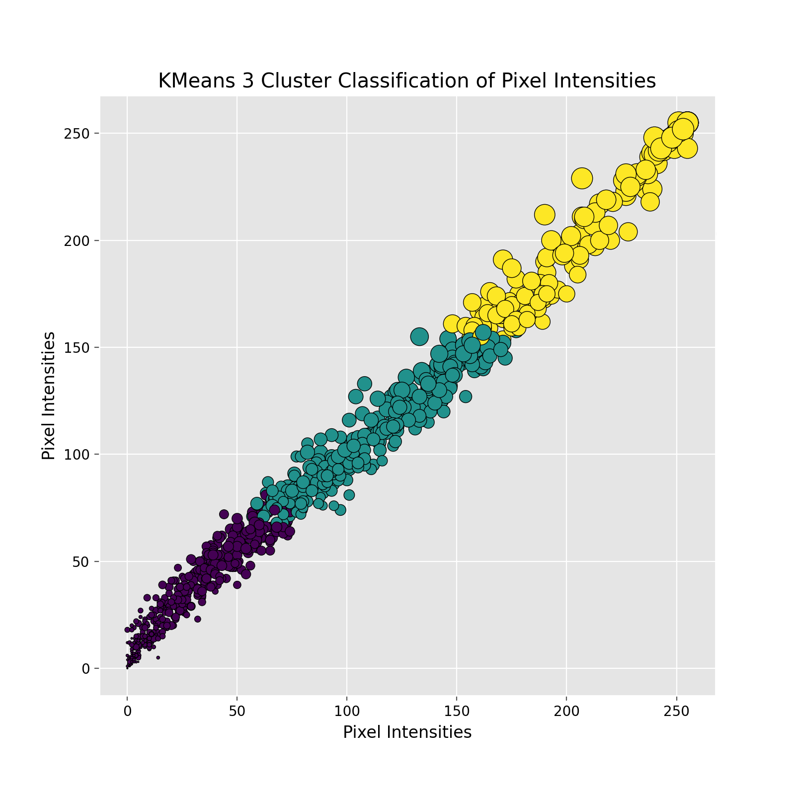
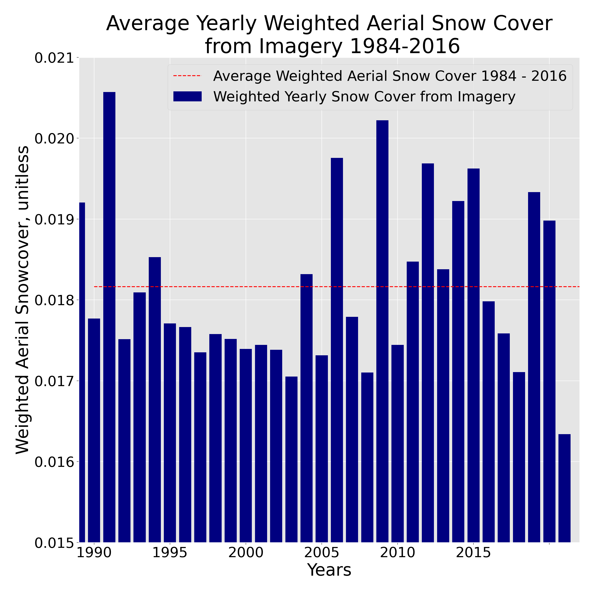
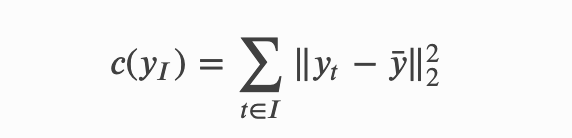
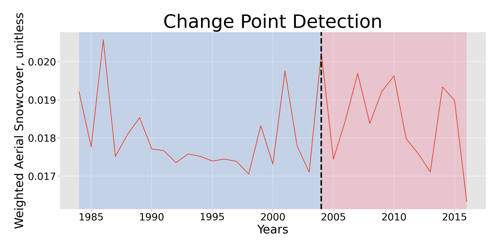

# Changes in Aerial Snow Cover in Southern Chile, 1984 - 2016
### Alex Truby
### Galvanize DSI - Capstone 3

_____

______

## Project Scope
For years, scientists have been tracking average snowfall, glacier retreat, and similar metrics for regions around the world. As a water engineer and avid outdoorist, these trends are very interesting to me not only for environmental reasons, but recreational reasons as well. While I don't necessarily have the tools at hand at the moment to track exactly the variables noted above, I was curious if I would be able to asses similar trends using the data I *do* currently have available to me. 

That being said, **the goal of this project is to utilize satellite imagery to determine if aerial snow cover in Southern Chile has changed significantly over the years of 1984 - 2016, and if so, when did a shift start to occur**. 

It is important that this project will not attempt to quantify *volume* of snowpack each year, rather just the *aeriel extent* of the snowpack. This aspect is still very important both for communities who may be reliant upon snowpack for water, as well as communities reliant upon snow extent for recreational purposes. 

_____

## Project Workflow

* Collect satellite imagery for Area(s) of Interest (AOI) for years 1984 - 2016
* Utilize KMeans Clustering to determine extent of snowpack in each Image
* Compile data from image processing into a data frame, with each region weighted to better represent total area analyzed
* Use change point analysis to determine if a change in aerial extent of snow cover has occured in the time period analyzed 
* IF a changepoint is identified, perform hypothesis test to determine if the change is significant

<table>

  <tr>
    <td></td>
  </tr>
 </table>

-----
## Satellite Image Processing
Aeriel imagery was collected from Google Earth Pro, which utilizes data from the Copurnicus satellites, for 10 regions in southern Chile over the years 1984 - 2016. Before 1984, satellite imagery from this source was unavailable. KMeans Clustering was then implemented on each image to quantify the proportion of the image that represented snow cover. The below sequence of images captures this process.

The first image on the left is an example of the raw satellite imagery. The middle image shows the image classification with using only 2 KMeans clusters. While the yellow regions *do* capture the portions of the image that contain snow, they also contain areas above tree line and the glacial moraines beneath the mountains. Including these portions of the image with snow cover would not provide an accurate analysis - primarily because those regions are unlikely to change much over time unless tree line changes and/or the river changes course. Implementing only two clusters would not allow for a meaningful comparison of the images over time. Once three clusters were implemented however, the algorithm did a good job of isolating the snow covered areas, as illustrated below. Both the areas above treeline and the moraines are now classified with a different cluster, leaving only those regions covered in snow classified by the "yellow" cluster.

<table>

  <tr>
    <td></td>
    <td></td>
    <td></td>
  </tr>
 </table>

In addition to the example of image processing above, the below scatter plots do a good job of illustrating how each pixel in the images are classified, as well as why it is important to add the third cluster. You can see that the additional cluster significantly reduces the number of pixels in the imgage that are classified as snow.  Again, just as in the images above, yellow represents the pixels that are identified as snow. The below scatter plots were created using only a small portion of data from a single image for better interpretation. 

<table>

  <tr>
    <td></td>
    <td></td>
  </tr>
 </table>

Often KMeans clustering is implemented only once in order to identify unstructured patters or groups within a data set. For this purpose, the label of the cluster centers would not matter, as long as if the process was repeated the underlying patterns or groups within the data set were classified in the same way.

While the end goal is the same for this project (identifying different groups within an image), in this case it *does* matter which cluster center each pixel is assigned to because this information will later be analyzed as a time series. If snow cover is represented by a different cluster each time an image is processed, it would be impossible to draw meaningful conclusions from the data. In terms of visualizations, pixels associated with this cluster will always be represented with yellow for this analysis. This was ensured through a masking technqiue, which can be viewed in the image_processing.py file in the src folder. 

This process was repeated for over 300 images in 10 different areas of southern Chile, in order to quantify the proportion of each image that represents snow cover. The proportion of snow cover from each image was then transformed into a data frame, and weighted to that each image was more representative the entire region analyzed as a whole.

------

## The Data

The below image gives an illustration of the weight aerial snowcovers, averaged across regions, for the years 1984 - 2016. Again, the remaining goals of this project to be addressed are two-fold: 1) determine if a change in aerial extent of snow cover has occured in the time period analyzed, and 2) if a changepoint is identified, perform hypothesis test to determine if the change is significant. Just looking at the below dataset visually, it looks as if there *may* be some sort of change in trend over the second half of the data set, but we will need to do some further analysis to confirm or deny that assumption. 

<table>

  <tr>
    <td></td>
  </tr>
 </table>

------
## Change Point Detection

Change point detection is a technique that can be applied to time series data to identify abprupt shifts in time series trends, and can be used to identify a shift in mean, mode, median, etc. Change point detection can be implented for both off-line and on-line time series datasets. Because the data analyzed for this project has been fully collected, an off-line approach will be taken here. This means that the entire time series is of intereset, not just the most recent points with the purpose of future prediction. 

While there are a few different offline algorithms that can be implemented for change point detection, a binary segmentation approach was implemented for this project. Binary segmentation was chosen because: 1) it is the best documented changepoint detection method, and 2) it has a low computational cost of O(n logn). This algorithm works by implementing a single chengepoint method across the entire sequence, testing if there is a split for which the cost function on either side of the split is smaller than the cost function across the entire time series. There are many different cost functions that can be implemented, depending on what sort of shift you are trying to identify. For the purpose of this project, we are trying to determine if there has been a shift in the mean aerial snow cover for these regions from 1984 - 2016, and so a cost function was implemented that is designed to capture mean-shifts in the signal:

<table>

  <tr>
    <td></td>
  </tr>
 </table>

Implementing this binary segmentation method, the below chart illustrates that there is indeed a changepoint in weight aerial snowcover identified in ~2004. The below chart was created by adapting code from the Python Ruptures package, with documentation for that package available [here](https://github.com/deepcharles/ruptures).

 
While this change point detection method does identify if there has been a shift in the time series, it does **not** determine whether or not that shift is meaningful or statistically significant. In order to determine if the changepoint holds any significane, a separate hypothesis test must be performed. 

------
## Hypothesis Test

In order to determine whether or not the shift in mean during the time period analyzed was meaningful, a hypothesis test was perfomed under the following conditions:

* **Null Hypothesis (H0):** There is no change in mean aerial snow cover for the time period analyzed.
* **Alternative Hypothesis (HA):** There has been a meaningful shift in the mean earial snow cover for the time period analyzed
* **Significance Threshold (alpha):** 0.05

Performing a two-tailed t-test, comparing the data points before and after the change point identified using the binary segmentation approach, the resulting p value was as follows:

**p value = 0.17**

The results of this hypothesis test indicate that there has **not been a meaningful shift in mean aerial snow cover** for the time period analyzed. We *cannot* conclude that the aerial extent of snow cover has either increased, or decreased, for this region of southern chile over the years 1984 - 2016.

-----
## Conclusion

As stated above, the conclusion of this project is as follows:

**While there has been a shift in the mean aerial snow extent for this region of southern Chile, the shift is not statistically significant. This region of Chile does not appear to have either consistently gained or lost snow over the years 1984 - 2016.**

-----
## Next Steps
While the scope of this project was constrained by data to only look at that of the *aerial extent* of snow cover for these regions, as a water engineer I would very much like to expand the scope to account for total volume of snowpack. An understanding of snowpack volumes, which translate to volume of water run off in the spring and summer, can be extremely important for both communities trying to plan water supply, as well as for recreationalists depending on snow for their activities.

In order to expand this study to account for total snow volume, additional data would be required:
* Current snow pack for regions of interest
* Precipitation data specifically within the extent of the areas analyzed

